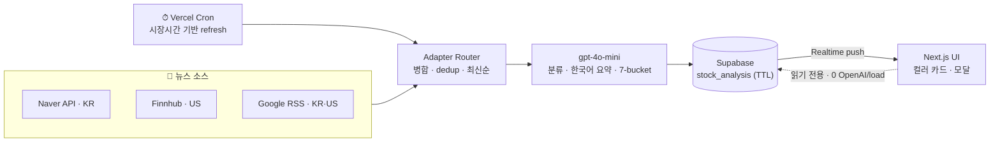
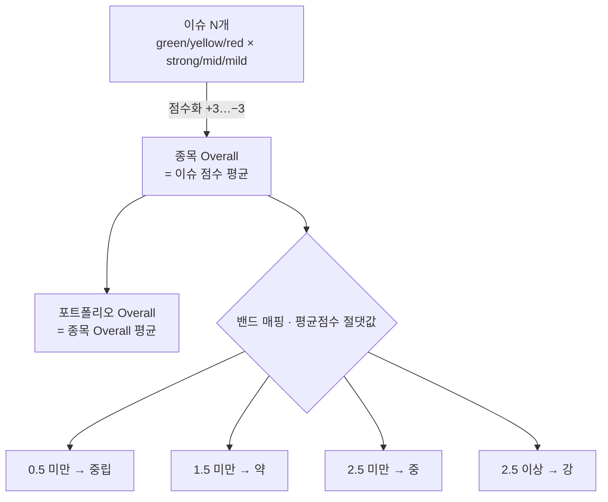
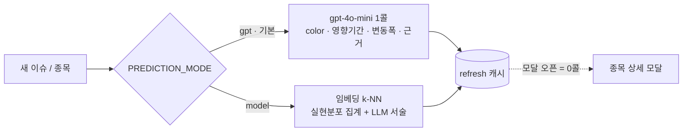
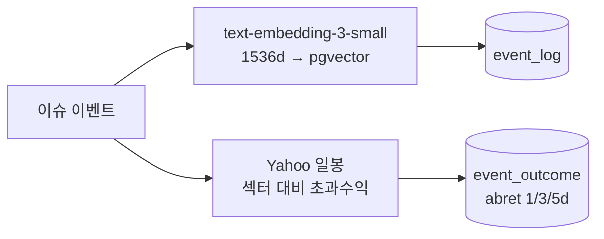
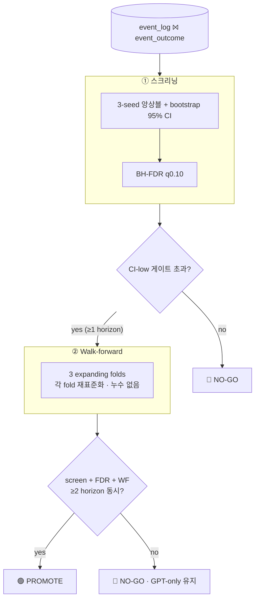

<div align="center">

# 🎨 Signal Palette

**내 포트폴리오 종목의 이슈를 _색깔_ 하나로 읽는 AI 대시보드**

뉴스 → AI 분류 → 7단계 시그널 컬러 → 종목·포트폴리오 종합색, 그리고 그 위에 얹은 **정직한 예측·평가 레이어**.

<br/>


</div>

---

## 🟢 한눈에 — 7단계 시그널 팔레트

<div align="center">


`긍정` ───────────────────────────► `중립` ───────────────────────────► `부정`

</div>

| 시그널 | Hex | 점수 | | 시그널 | Hex | 점수 |
|---|---|:--:|---|---|---|:--:|
| 🟢 `positive_strong` | `#22C77F` | **+3** | | 🔴 `negative_strong` | `#F0506E` | **−3** |
| 🟢 `positive_mid` | `#5DD9A0` | +2 | | 🔴 `negative_mid` | `#F47C95` | −2 |
| 🟩 `positive_mild` | `#9FE8C5` | +1 | | 🟥 `negative_mild` | `#F8A8B8` | −1 |
| 🟡 `neutral` | `#F8E29A` | 0 | | ⬛ `empty` | `rgba(255,255,255,.06)` | — |

---

## 🏗️ 시스템 아키텍처

> **로드당 OpenAI 호출 = 0.** 모든 분석/예측은 스케줄러가 미리 구워 DB에 캐시 → 클라이언트는 Realtime으로 읽기만.



---

## 🎯 컬러 결정 로직 — 결정적 집계

> 색은 LLM의 "느낌"이 아니라 **점수 집계**에서 나온다 (재현 가능 · 디버깅 가능).



| 레이어 | 산출 | LLM 호출 |
|---|---|:--:|
| 이슈 → 시그널 | gpt-4o-mini가 7-bucket 분류 + 한국어 1문장 요약 | 종목당 캐시 |
| 종목 Overall | 이슈 점수 **평균 → 밴드** (`overall.ts`) | **0** |
| 포트폴리오 Overall | 종목 Overall **평균** (`aggregateOverall`) | **0** |

---

## 🔮 예측 레이어 — 스위처블 2-모드



<sub>※ GPT 모드의 숫자는 *검증된 예측이 아니라 판단*. 아래 평가에서 방향/per-issue 변동폭에 일반화 신호가 없음을 확인했기에, 검증된 엔진으로 언제든 교체 가능하도록 모드로 분리해 둠.</sub>

---

## 🧪 핵심 차별점 — "예측할 수 없음"을 _증명_ 하고, 그 위에서 정직하게 설계

> 주가 예측기를 만들었다고 우기지 않는다. **예측 가능성을 직접 측정하고, 검증된 신호만 배포하며, 안 되는 가설은 자동 재검증한다.**

### ① 학습 메모리 (forward 축적 + 과거 백필)




### ② 8개 독립 진단 → 일관된 결론

| # | 진단 | 질문 | 결과 | 판정 |
|:--:|---|---|---|:--:|
| 1 | Quantile MLP | 다음날 *방향* 예측? | `dir_hit ≈ 0.50` | 🔴 NO-GO |
| 2 | Magnitude | *변동폭* 예측? | `ρ0.33` — 전부 cross-stock(섹터/종목), 임베딩 기여 ≈0 | 🟡 종목수준뿐 |
| 3 | Within-stock | *이 이슈*가 그 종목 평소보다? | `ρ≈0.02` | 🔴 신호 없음 |
| 4 | Issue-type | 유형별 변동폭? | earnings `ρ0.10 @1d`, 3/5d 소멸 | 🟡 약함·휘발 |
| 5 | GPT type/intensity | GPT가 키워드 휴리스틱 이김? | 못 이김 | 🔴 |
| 6 | Drift backtest | 호재→미래 초과수익 드리프트? | `pos5d 0.494` (≈동전) | 🔴 |
| 7 | Robust backtest | 임계 스윕 · GPT 완전 제거 | 전부 `≈0.50` | 🔴 |
| 8 | Shadow eval (지속) | H1 변동폭 / H2 방향 | 아래 게이트 → NO-GO | 🔴 |

> **결론:** 1~5일 *방향*은 효율적시장(예측 불가). 예측 가능한 건 **종목 변동성(크기)** 과 **어닝 플래그**뿐 — 신경망 없이 통계 한 줄로 잡힘. → **방향 = 이슈 signal, 진하기 = 종목 변동성**.

### ③ 섀도 평가 게이트 — 사전등록 · 월간 자동 재검증

> 프로덕션은 **GPT-only 그대로**. 통계 엔진은 _사전등록한 게이트를 통과할 때만_ 승격되는 challenger. 통과 못 하면 자동으로 GPT로 강등(= graceful).



| 가설 | 타깃 | 게이트 | 현재(US 10k) |
|---|---|---|:--:|
| **H1** within-stock 변동폭 | `\|abret\|` 종목내 표준화 | ρ CI-low > 0.05 | 🔴 0.03 |
| **H2** 방향 | `sign(abret)` | dir_hit CI-low > 0.53 | 🔴 ≈0.50 |


<sub>※ 첫 CI 실행에서 H1-1d가 CI-low 0.0502로 게이트를 간발로 넘어 "candidate"로 떴으나, **3-seed 앙상블**(→0.028)과 **3-fold walk-forward**(전 fold 탈락)가 단일-split 경계 노이즈임을 잡아냄. 가짜경보를 막는 규율이 곧 산출물.</sub>

---

## 🗂️ 레포 구조

```
src/
├─ app/                  Next.js App Router · API routes · 페이지
├─ components/           컬러 카드 · 모달 · 드래그 편집 · ticker
└─ lib/
   ├─ news/              📰 소스 어댑터 (Naver·Finnhub·Google RSS) + 병합·dedup
   ├─ openai.ts          🤖 분류·요약·예측 GPT 호출
   ├─ overall.ts         🎨 결정적 컬러 집계 (이슈→종목→포트폴리오)
   ├─ predict/           🔮 예측 레이어 (gpt · k-NN 2-mode + 캐시·포맷)
   ├─ events/            🧠 학습 이벤트 캡처·라벨링 (pgvector)
   ├─ prices/            📈 Yahoo 일봉 · 섹터 초과수익
   └─ supabase/          🔐 SSR auth · 캐시 · Realtime
supabase/migrations/     001~007 (auth · 캐시 · Realtime · 이벤트스토어 · 예측)
ml/                      🧪 오프라인 평가 (Python·PyTorch — 앱에 미포함)
   ├─ SHADOW_EVAL.md     📋 사전등록 문서 (타깃·게이트·승격조건)
   ├─ shadow_eval.py     🛡 2-stage 게이트 (앙상블·FDR·walk-forward)
   └─ diagnose_*·backtest_*  8개 진단·백테스트
.github/workflows/       ⚙️ shadow-eval.yml (월간 자동 재검증)
```

---

## 💡 What this demonstrates

| 영역 | 구현 |
|---|---|
| **Production LLM** | 구조화 분류·요약·예측, 스키마 검증·클램프·graceful fallback |
| **비용 엔지니어링** | 어댑터 + DB 캐시 + Realtime + cron → **로드당 OpenAI 0콜** |
| **데이터 파이프라인** | 다중 소스 병합·dedup·시장별 라우팅·TTL 캐시·누적 보관 |
| **벡터 검색** | pgvector 임베딩 k-NN · 섹터 폴백 · 콜드스타트 처리 |
| **정직한 ML 평가** | 사전등록 · lookahead-safe split · walk-forward · BH-FDR · 앙상블 · champion/challenger |
| **인프라** | Supabase RLS · SSR auth(OAuth) · Vercel Cron · GitHub Actions 자동화 |

<div align="center">
<br/>

> **"예측기를 만든 게 아니라, 언제 자신이 모르는지 아는 시스템을 만들었다."**

<sub>Next.js · TypeScript · Supabase · OpenAI · PyTorch — 설계/개발 전 과정 1인</sub>

</div>
